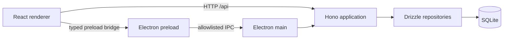

# Oh My Canvas 架构

## 目标

当前仓库只提供可扩展的桌面应用底座。业务模块后续应落在明确的 feature/package 边界内，不直接耦合 Electron API、数据库驱动或窗口生命周期。

## 运行时

开发模式下，Vite 负责渲染器热更新；Electron 主进程在 loopback 地址启动 Hono API，并由 Vite 代理 `/api`。生产模式下，Electron 在随机 loopback 端口同时提供 API 和构建后的静态资源。

## 模块边界

| 模块 | 责任 | 不应包含 |
| --- | --- | --- |
| `apps/electron` | 窗口生命周期、本地服务、受控系统能力 | React 业务状态、SQL 查询 |
| `apps/web` | 页面、交互、前端状态和 API client | Node/Electron 直接调用 |
| `apps/api` | HTTP 路由、认证、中间件、应用服务组装 | 窗口和 DOM 逻辑 |
| `packages/contracts` | IPC 通道和跨进程类型 | 平台实现、业务副作用 |
| `packages/db` | schema、query、Bun/Node SQLite 适配 | UI 和 Electron 生命周期 |
| `packages/logger` | 日志格式、滚动文件和错误元数据 | 业务流程 |

## 数据与进程

- Bun API 使用 `bun:sqlite`，Electron 内置 API 使用 `better-sqlite3`，两者复用同一套 Drizzle schema 和 query；Node 安全的 `packages/db/src/runtime.ts` 避免把 Bun 驱动打进 Electron。
- 打包应用的数据库与日志默认写入 Electron `userData`，不写入安装目录。
- 渲染进程开启 `contextIsolation` 和 sandbox，并关闭 Node integration。
- preload 只暴露 `packages/contracts` 中声明的白名单能力。
- 外部导航只允许 `http`、`https` 和 `mailto`，其余协议被拒绝。
- 所有 Electron 权限请求默认拒绝，后续按具体业务逐项开放。

## 扩展约定

新增业务时优先使用垂直 feature：前端放入 `apps/web/src/features/<feature>`，API 路由放入 `apps/api/src/routes`，共享领域逻辑在复杂度足够时再提取到 `packages/<domain>`。不要让渲染器绕过 API 直接访问数据库，也不要把任意 IPC 调用暴露给页面。
